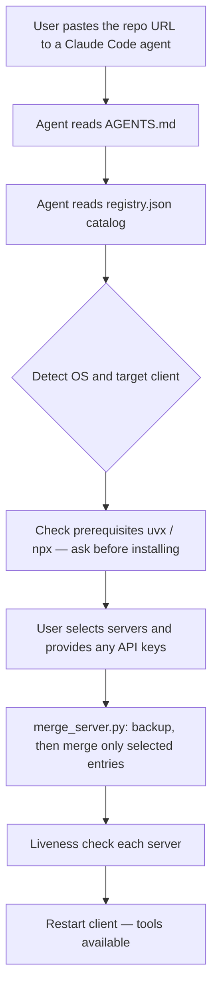

# claude-mcp-stack

**An agent-first installer recipe for finance & research MCP servers.**

[](https://github.com/mgatorr/claude-mcp-stack/actions/workflows/ci.yml)
[](LICENSE)


> **Not affiliated with, endorsed by, or sponsored by Anthropic.** "Claude" refers only to
> the target client. This is an independent, community-maintained project.

## What it is

A curated, **agent-first** recipe: hand the repo link to a Claude Code agent and it installs
a vetted set of finance/research MCP servers into your Claude client — end to end. It is a
**recipe, not a vendor dump**: third-party servers are launched via `uvx`/`npx` (their code
is never copied here), and the one maintained component is a small fork credited below.

## Quickstart (agent flow)

1. Open Claude Code.
2. Say: *"Install the MCP servers from https://github.com/mgatorr/claude-mcp-stack"*.
3. The agent detects your OS and client, asks which servers you want, prompts for any API
   keys, backs up your config, merges the servers, and verifies each one starts.
4. Restart your client (Desktop/Cowork: `Cmd+Q` and reopen).

> Before running, you can review [`AGENTS.md`](AGENTS.md) — it is the exact playbook the
> agent follows, including that it **asks before installing any system package**.

## Example agent session

```text
You:   Install the MCP servers from https://github.com/mgatorr/claude-mcp-stack
Agent: Detected macOS + Claude Desktop. uvx ✓, npx ✓.
       Which servers? [default: all] → all
       twelvedata needs an API key (https://twelvedata.com/account/api-keys): ****
       sec-edgar needs a User-Agent "Name email": Jane Doe you@example.com
       Backed up claude_desktop_config.json → .bak.20260530-101500
       Merged 6 servers. Liveness: twelvedata ✓ yahoo-finance ✓ sec-edgar ✓
       coingecko ✓ fetch ✓ youtube-transcript ✓
       Done — restart Claude (Cmd+Q) to load the tools.
```

## How it works

The repo splits **data** (`registry.json`, the catalog) from **process** (`AGENTS.md`, the
playbook). A small, tested helper (`scripts/merge_server.py`) performs a backup-first,
non-destructive merge into your client config.



## Supported clients

- **Claude Desktop / Cowork** → `claude_desktop_config.json`
- **Claude Code (CLI)** → `.mcp.json` / `claude mcp add`

## Servers

| Server | Category | Runtime | API key? | Docs |
|--------|----------|---------|----------|------|
| twelvedata | finance | uvx | **Yes** | [servers/twelvedata.md](servers/twelvedata.md) |
| yahoo-finance | finance | local (fork) | No | [servers/yahoo-finance.md](servers/yahoo-finance.md) |
| sec-edgar | finance | uvx | User-Agent | [servers/sec-edgar.md](servers/sec-edgar.md) |
| coingecko | crypto | npx | No | [servers/coingecko.md](servers/coingecko.md) |
| fetch | web | uvx | No | [servers/fetch.md](servers/fetch.md) |
| youtube-transcript | media | npx | No | [servers/youtube-transcript.md](servers/youtube-transcript.md) |

## Prerequisites

- [`uv`/`uvx`](https://docs.astral.sh/uv/) — for the Python-based servers.
- [Node.js](https://nodejs.org) (`npx`) — for the Node-based servers.

The agent checks these and, if one is missing, **asks before installing** it.

## Manual install (no agent)

1. Open the template for your client in [`templates/`](templates/).
2. Copy the `mcpServers` entries you want into your client config.
3. Replace `${...}` placeholders with your keys; for `yahoo-finance`, clone the pinned fork,
   run `uv venv` + `uv pip install -e .`, and set its `command` to the built binary.
4. Restart your client.

## Security & secrets

- Your API keys are written **only** to your local client config — never to this repo.
- Templates are **placeholder-only**; a two-layer secret scan (`scripts/check_no_secrets.sh`)
  runs in CI over the working tree and git history.
- If a key is ever exposed, **rotate it**. See [SECURITY.md](SECURITY.md).

## Scope — what this is NOT

- Not a runnable installer script (the playbook is transparent and reviewable).
- Does not copy or redistribute third-party server code.
- Does not store your secrets.
- Targets Claude Desktop/Cowork and Claude Code only (for now).

## FAQ

- **Is this official?** No — see the disclaimer above.
- **Are my keys safe?** They stay in your local client config; nothing secret is committed.
- **Why an agent instead of a script?** Transparency and cross-platform robustness — you can
  read exactly what it will do in `AGENTS.md`.
- **Can I add my own server?** Yes — see [CONTRIBUTING.md](CONTRIBUTING.md). One catalog entry
  plus one doc.

## Acknowledgements

Built on excellent third-party MCP servers: Twelve Data, SEC EDGAR MCP, CoinGecko MCP,
`mcp-server-fetch`, and `@sinco-lab/mcp-youtube-transcript`. The bundled Yahoo Finance server
is a fork of [`mcp-yahoo-finance`](https://github.com/maxscheijen/mcp-yahoo-finance) by
Max Scheijen (MIT), with a small illiquid-symbol crash fix.

## License

[MIT](LICENSE) © 2026 Mario Garrido.
